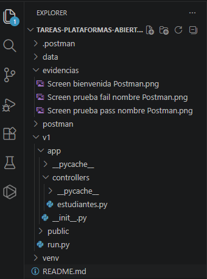
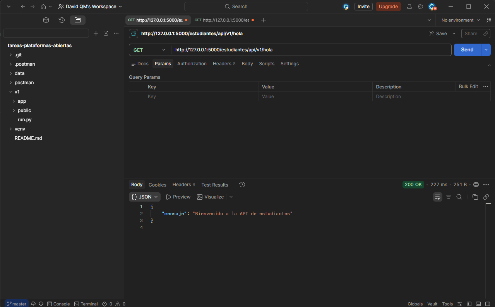
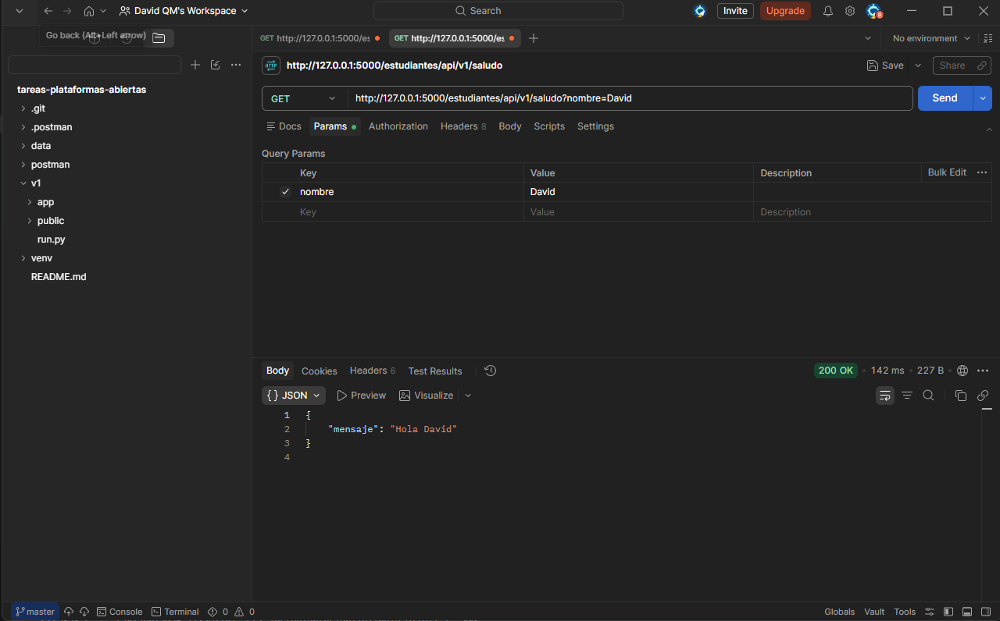
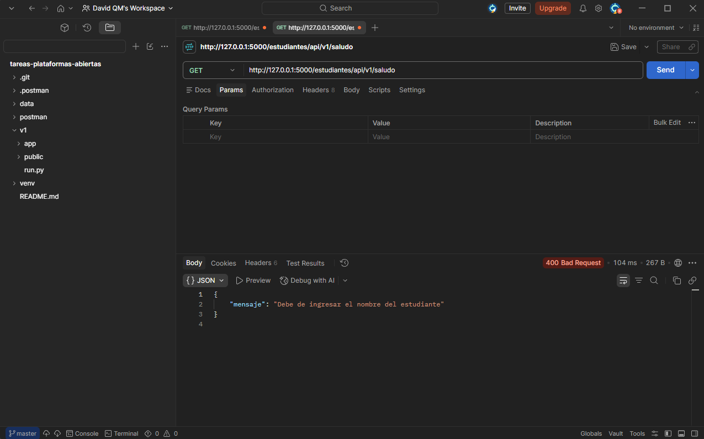

# Práctica 2 VSCode & Postman

## Descripción

Trabajo realizado en base a las instrucciones solicitadas para crear endpoints, instalando variedad de componentes desde la terminal de VSCode para luego hacer pruebas con el método GET mediante Postman.

## Estructura del Proyecto

## Tecnologías utilizadas

- Python 3.14
- Flask
- Flask CORS
- Postman (Pruebas)
- GitHub

## Evidencias

- Evidencia 1

- Evidencia 2

- Evidencia 3

## Realizado por

- David Quesada Mata

## Profesor

- Daniel Bogarín Granados